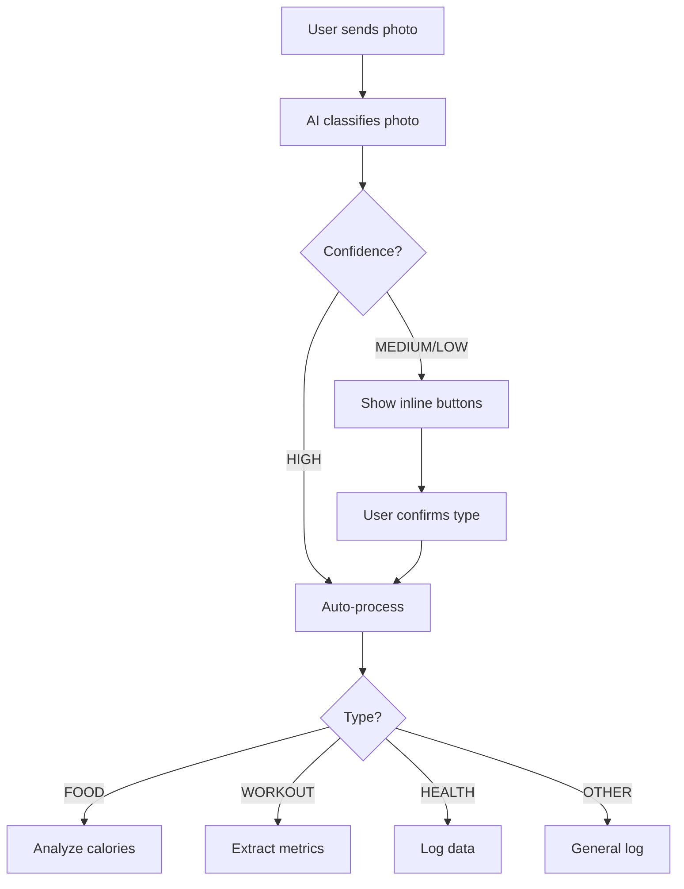

# 📸 Multi-Purpose Photo Handler - Feature Addendum

> **Доповнення до:** [implementation_plan.md](file:///Users/sensible/.gemini/antigravity/brain/71861ccc-96f5-4f3c-a0c0-e1af8d9f8fc3/implementation_plan.md)

## Огляд

Користувачі можуть надсилати фото не тільки їжі, але й:
- 🏃 **Результати тренувань** (скріншоти з Strava, Nike Run Club, etc.)
- ⚖️ **Прогрес здоров'я** (вага, виміри, progress photos)
- 📊 **Інша health-related інформація**

## Зміни Архітектури

### 1. База Даних - Додано `HealthLog`

```python
class HealthLog(Base):
    \"\"\"Generic health log for photos that don't fit food/workout\"\"\"
    __tablename__ = \"health_logs\"
    
    user_id = BigInteger
    category = String(50)  # weight, measurements, progress_photo
    description = Text
    data = JSON  # flexible data storage
    photo_url = String(500)
```

**Workout** також розширено:
- `activity_type` - running, gym, yoga, cycling
- `metrics` JSON - distance_km, calories_burned, pace

### 2. AI - Smart Photo Classification

**Нова функція `classify_photo()`:**

```python
# Gemini автоматично розпізнає тип фото
result = await ai_client.classify_photo(image_bytes)
# Returns: {"type": "food|workout|health|other", "confidence": "high|medium|low"}
```

**Prompting Strategy:**
```
Classify this image:
1. FOOD - meals, snacks, beverages
2. WORKOUT - fitness app screenshots, gym equipment, exercise demos
3. HEALTH - body measurements, weight scale, progress photos
4. OTHER - everything else
```

### 3. Telegram Bot - Interactive Flow

**Схема роботи:**



**Код хендлера:**

```python
@router.message(F.photo)
async def handle_photo(message: Message):
    photo_bytes = await download_photo(message)
    
    # Step 1: Classify
    classification = await ai_client.classify_photo(photo_bytes)
    
    if classification["confidence"] == "low":
        # Show inline keyboard
        keyboard = InlineKeyboardMarkup(inline_keyboard=[
            [InlineKeyboardButton(text="🍔 Їжа", callback_data="type:food")],
            [InlineKeyboardButton(text="🏃 Тренування", callback_data="type:workout")],
            [InlineKeyboardButton(text="⚖️ Здоров'я", callback_data="type:health")]
        ])
        await message.answer("Що це за фото?", reply_markup=keyboard)
        # Store photo for callback
        return
    
    # Step 2: Process based on type
    await process_photo(message.from_user.id, photo_bytes, classification["type"])
```

### 4. Processing Logic

```python
async def process_photo(user_id, photo_bytes, photo_type):
    if photo_type == "food":
        result = await ai_client.analyze_food_image(photo_bytes)
        # Save to Meal table
        
    elif photo_type == "workout":
        result = await ai_client.analyze_workout_image(photo_bytes)
        # Parse metrics, save to Workout table
        
    elif photo_type == "health":
        result = await ai_client.analyze_health_image(photo_bytes)
        # Save to HealthLog table
        
    else:
        # Generic log
        await save_generic_log(user_id, photo_bytes)
```

## Нові AI Methods

### `analyze_workout_image()`

```python
async def analyze_workout_image(self, image_bytes: bytes) -> Dict:
    prompt = \"\"\"
    Analyze this workout-related image:
    1. Activity type (running, cycling, gym, yoga, etc.)
    2. Duration (if visible)
    3. Distance (if visible)
    4. Calories burned (if visible)
    5. Other metrics (pace, heart rate, etc.)
    
    Return:
    Activity: [type]
    Duration: [minutes]
    Distance: [km]
    Calories: [number]
    Metrics: [other data]
    \"\"\"
```

### `analyze_health_image()`

```python
async def analyze_health_image(self, image_bytes: bytes) -> Dict:
    prompt = \"\"\"
    Analyze this health/progress image:
    1. Category (weight, body measurements, progress photo, etc.)
    2. Extract any visible numbers/metrics
    3. Provide description
    
    Return:
    Category: [type]
    Data: [extracted info]
    Description: [brief summary]
    \"\"\"
```

## Переваги Підходу

✅ **Автоматична класифікація** - AI розпізнає тип фото  
✅ **Fallback UX** - якщо AI не впевнений, користувач вибирає вручну  
✅ **Гнучка структура** - HealthLog для будь-яких інших типів  
✅ **Розширюваність** - легко додати нові категорії

## Implementation Priority

Для MVP:
1. ✅ **Database models** (вже готово)
2. 🔧 **AI classification** - додати до Task 3
3. 🔧 **Bot inline keyboards** - додати до Task 5
4. 🔧 **Processing logic** - додати до Task 5

Детальні кроки вже є в основному плані!
